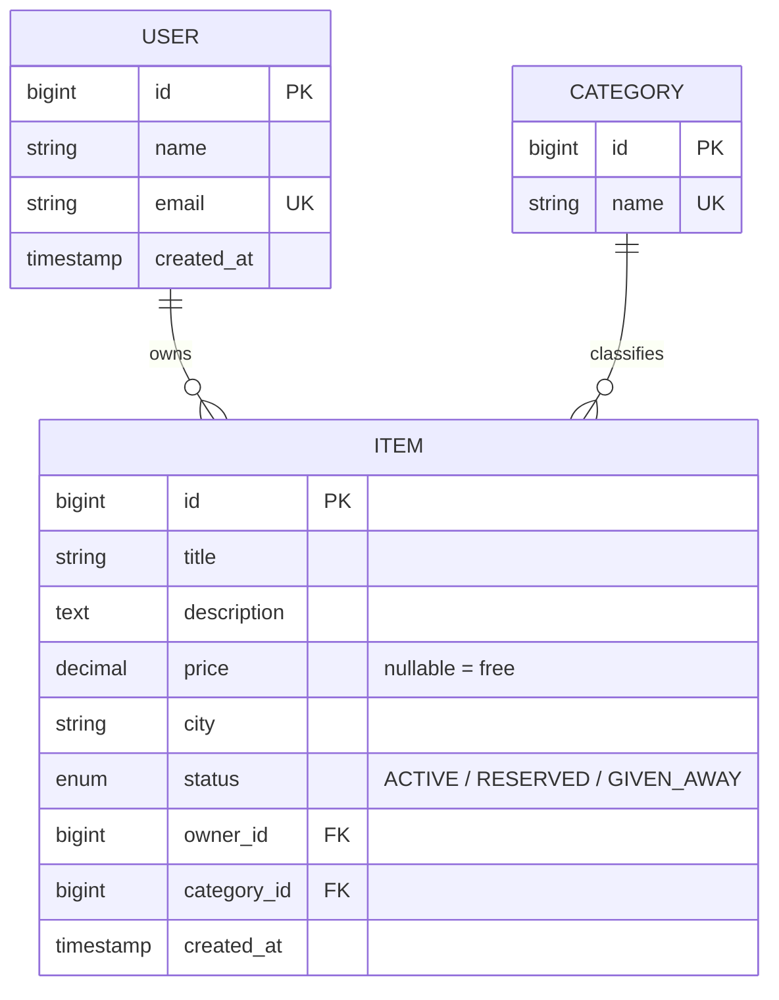

# RegiveApp

A platform for giving away or reselling unwanted items. A user posts a listing for
something they no longer need (for free or for a price); others browse the feed,
filter by city and category, and reserve an item to arrange a handover.

This is a portfolio project built as an incremental learning journey — each phase
adds one production-grade concern (migrations, security, caching, messaging,
observability) on top of a clean CRUD core, rather than bolting everything on at once.

## Tech stack

| Area      | Technology                              |
|-----------|-----------------------------------------|
| Language  | Java 21 (LTS)                           |
| Framework | Spring Boot 4.1 (Web, Data JPA, Validation) |
| ORM       | Hibernate / Spring Data JPA             |
| Database  | PostgreSQL                              |
| Build     | Maven                                   |
| Config    | `.env` via spring-dotenv                |

## Architecture

The codebase is organized **by feature** (`user`, `category`, `item`) rather than by
technical layer, with a shared `common` package for cross-cutting concerns. Each
feature follows a clean three-layer split:

- **Controller** — REST endpoints, request/response mapping, HTTP status codes.
- **Service** — business logic and transaction boundaries (`@Transactional`).
- **Repository** — Spring Data JPA interfaces (derived queries + JPQL).

Additional design decisions:

- **DTO boundary** — JPA entities never leave the API; requests and responses use
  immutable `record` DTOs. This decouples the persistence model from the API contract.
- **Centralized error handling** — a single `@RestControllerAdvice` maps exceptions to
  a consistent JSON error body with correct status codes (400 / 404 / 409).
- **Bean Validation** — `@Valid` on incoming DTOs; field-level errors are collected and
  returned to the client.

### Domain model



## Getting started

### Prerequisites

- JDK 21
- PostgreSQL running locally
- (Maven is bundled via the wrapper — `./mvnw`)

### 1. Create the database

```bash
psql -U postgres -c "CREATE DATABASE regiveapp;"
```

### 2. Configure environment

Copy the example file and fill in your local credentials:

```bash
cp .env.example .env
```

```dotenv
DB_URL=jdbc:postgresql://localhost:5432/regiveapp
DB_USERNAME=postgres
DB_PASSWORD=your_password
```

`.env` is git-ignored and never committed.

### 3. Run

```bash
./mvnw spring-boot:run
```

The API starts on `http://localhost:8080`. On first run, Hibernate creates the schema
automatically (`ddl-auto=update`). This is replaced by Flyway migrations in a later phase.

## API

| Method | Endpoint                                   | Description                          |
|--------|--------------------------------------------|--------------------------------------|
| POST   | `/api/users`                               | Create a user                        |
| GET    | `/api/users`                               | List users                           |
| GET    | `/api/users/{id}`                          | Get a user                           |
| PUT    | `/api/users/{id}`                          | Update a user's name                 |
| DELETE | `/api/users/{id}`                          | Delete a user                        |
| POST   | `/api/categories`                          | Create a category                    |
| GET    | `/api/categories`                          | List categories                      |
| DELETE | `/api/categories/{id}`                     | Delete a category                    |
| POST   | `/api/items`                               | Create a listing                     |
| GET    | `/api/items?city=&categoryId=`             | Search listings (optional filters)   |
| GET    | `/api/items/{id}`                          | Get a listing                        |
| PUT    | `/api/items/{id}`                          | Update a listing                     |
| POST   | `/api/items/{id}/claim`                    | Reserve a listing                    |
| DELETE | `/api/items/{id}`                          | Delete a listing                     |

## Roadmap

The project grows one concern at a time:

- [x] **1. CRUD core** — Spring Boot + Spring Data JPA + PostgreSQL, layered
  architecture, DTOs, validation, centralized error handling
- [x] **2. Testing** — JUnit 5 + Mockito unit tests for the service layer
- [x] **3. Migrations** — replace `ddl-auto` with Flyway
- [x] **4. Security** — Spring Security + JWT, registration/login, roles
- [x] **5. Caching** — Redis for hot endpoints
- [x] **6. Messaging** — Kafka: notify subscribers when a matching listing appears
  (event-driven), with the Outbox pattern for consistency
- [ ] **7. Integration testing** — Testcontainers (real PostgreSQL and Kafka)
- [ ] **8. DevOps** — Docker, docker-compose, GitHub Actions CI
- [ ] **9. Observability** — structured logging, Micrometer + Prometheus/Grafana
- [ ] **10. Advanced** — concurrency-safe reservations (Redis distributed lock),
  N+1 fixes, query optimization with `EXPLAIN ANALYZE`

## Notes

Some rough edges are **intentional** at this stage and are addressed in later phases:
the reservation endpoint has no race-condition protection yet (Redis distributed lock,
phase 10), and the item search exhibits the classic N+1 query pattern
(fixed and benchmarked in phase 10).
